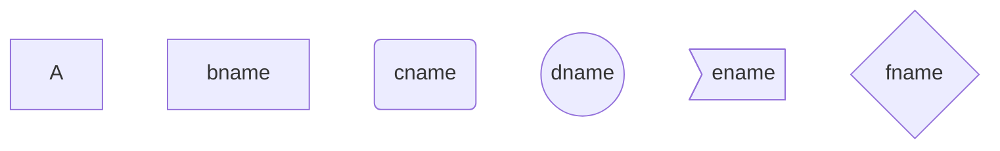

Markdown里面的流程图
Markdown中使用mermaid画流程图（基础）

# 节点
1. 默认节点 A
2. 文本节点 B[bname]
3. 圆角节点 C(cname)
4. 圆形节点 D((dname))
5. 非对称节点 E>ename]
6. 菱形节点 F{fname}



# 连线
节点间的连接线有多种形状，而且可以在连接线中加入标签：

1. 箭头连接 A1–>B1
2. 开放连接 A2—B2
3. 标签连接 A3–text—B3 或者 A3—|text|B3
4. 箭头标签连接 A4–text –>B4 或者 A4–>|text|B4
5. 虚线开放连接 A5.-B5 或者 A5-.-B5 或者 . A5..-B5
6. 虚线箭头连接 A6.->B6 或者 A6-.->B6
7. 标签虚线连接 A7-.text.-B7
8. 标签虚线箭头连接 A8-.text.->B8
9. 粗线开放连接 A9===B9
10. 粗线箭头连接 A10==>B10
11. 标签粗线开放连接 A11==text===B11
12. 标签粗线箭头连接 A12==text==>B12


# 例子


```flow
graph TD;
    st(开始)-->op
    op-->co
    co--no-->sub
    sub-->op
    co--yes-->out
    out-->en

```

[Markdown里面使用mermaid画流程图（基础）](http://blog.csdn.net/subson/article/details/78054689)